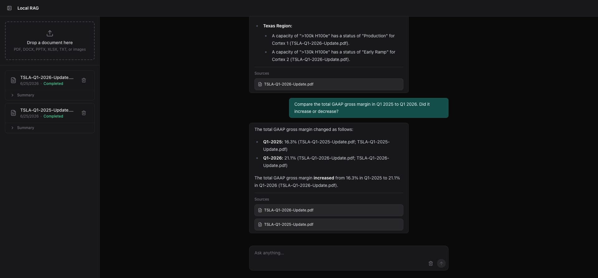

## Overview

Local-RAG lets you chat with your documents entirely offline. Simply upload your files, and the system will automatically prepare and index them so you can start asking questions right away. Because everything from embeddings to retrieval runs locally on your machine, your data remains completely private. Every answer includes direct citations to help you easily verify the original source material.

Please note: This is an early, functional prototype. It is a work in progress and not yet a polished, production-ready solution.



## Features

- Ingest PDFs, DOCX, PPTX, XLSX, TXT and images (PNG, JPEG, TIFF, BMP, GIF).  
- Convert files with Docling, then split markdown with a custom heading‑ and table‑aware chunker.  
- Generate document summaries on ingest via a map‑reduce pipeline.  
- Stream chat answers token‑by‑token, embedding inline citations `(filename)`.  
- Extract cited sources and display them in a structured UI.  
- Detect filename conflicts and provide an overwrite/re‑ingest workflow.  
- Re‑ingest creates new chunks and automatically removes stale vectors from earlier generations.  
- Process ingestion asynchronously using a background job queue with heartbeat logging.  
- Harden against prompt injection through a strict instruction hierarchy, HTML escaping, and source‑tag isolation.  
- Run entirely locally—no external API calls; all LLM inference, embeddings, and vector storage use Ollama and Qdrant.

## Tech Stack

- Document processing: Docling conversion plus custom markdown-aware chunking – PDFs, DOCX, PPTX, XLSX, TXT, images.
- LLM & embeddings: Ollama (local) – gemma4:e4b for chat, bge-m3 for embeddings.
- Vector store: Qdrant for similarity search on document embeddings.
- Metadata storage – SQLite (async) for document info.
- Backend: Python 3.11, FastAPI (async), Uvicorn.
- Frontend: React 19, TypeScript, Vite, Tailwind CSS, TanStack React‑Query.
- Deployment: Docker Compose (backend, frontend, Qdrant); Ollama runs separately as a local or reachable service.

## Architecture

*Ingestion Flow*

```
Upload → Sanitize → Docling Conversion → Markdown Chunking
   ├→ Embed Chunks (Ollama) → Qdrant (Vector Store)
   └→ Summarize (LLM Map-Reduce) → SQLite (State Store)
```

*Chat Flow*

```
User Query
    ↓
Embed Query (Ollama) → Vector Search (Qdrant, Top-K chunks)
    ↓
Build RAG Prompt (system prompt + retrieved chunks)
    ↓
Stream Tokens from LLM (Ollama) → SSE → Client
    ↓
[After all tokens streamed]
    ↓
Filter Cited Sources (validate which chunks were actually cited)
    ↓
Send Citations → SSE → Client (attaches to the completed answer)
    ↓
DONE
```

## Getting started

### Prerequisites

Before you begin, ensure you have the following installed:

*   **Docker & Docker Compose** (for running Qdrant, the backend, and the frontend)
*   **Ollama** running locally or on a reachable network (models can be pulled separately).
*   **Python 3.11** (if running the backend natively)
*   **Node.js 18+ & npm**

#### Pull Required Ollama Models

```bash
ollama pull bge-m3:latest
ollama pull gemma4:e4b
```

#### Run Ollama

Ensure the Ollama service is running (default `http://localhost:11434`). You can start it with:

```bash
ollama serve
```

#### Then Run Qdrant, Backend & Frontend with Docker (recommended)

```bash
# Clone the repo
git clone https://github.com/SirajSpark/local-rag.git
cd local-rag

# Configure environment
cp .env.example .env
# Edit .env if needed — defaults work for most setups
# Ollama must be reachable at the URL in OLLAMA_BASE_URL

# Build and start Qdrant + backend + frontend
docker compose up -d --build

# Frontend runs on http://localhost:5173
# Backend runs on http://localhost:8000
# API docs at http://localhost:8000/docs
```

> **Note:** Ollama must be running on your host machine. The backend connects to it via `host.docker.internal`.

## Configuration

All configuration options are defined in `backend/app/core/config.py` and can be overridden via environment variables or a `.env` file.

| Variable               | Default                    | Description                              |
| ---                    | ---                        | ---                                      |
| QDRANT_HOST            | `qdrant`                   | Qdrant host                              |
| QDRANT_PORT            | `6333`                     | Qdrant port                              |
| QDRANT_COLLECTION      | `documents`                | Qdrant collection                        |
| OLLAMA_BASE_URL        | `http://localhost:11434`   | Ollama base URL                          |
| EMBEDDING_MODEL        | `bge-m3:latest`            | Embedding model                          |
| EMBEDDING_DIMENSIONS   | `1024`                     | Embedding vector size                    |
| LLM_MODEL              | `gemma4:e4b`               | LLM model                                |
| LLM_TEMPERATURE        | `0.1`                      | Sampling temperature                     |
| LLM_TOP_P              | `0.9`                      | Top‑p sampling                           |
| LLM_NUM_PREDICT        | `1024`                     | Max tokens to generate                   |
| LLM_NUM_CTX            | `65536`                    | Model context window                     |
| LLM_THINK              | `False`                    | Enable Ollama thinking mode              |
| CHUNK_MAX_TOKENS       | `512`                      | Max tokens per chunk                     |
| CHUNK_MIN_CONTENT_LENGTH | `120`                    | Minimum chunk content length             |
| TOP_K                  | `8`                        | Number of nearest neighbours             |
| MIN_SCORE              | `0.35`                     | Minimum similarity score                 |
| MAX_FILE_SIZE_MB       | `100`                      | Max upload size (MB)                     |
| DB_PATH                | `data/state.db`            | SQLite DB path                           |
| TEMP_DIR               | `data/tmp`                 | Temporary files directory                |
| LLM_TIMEOUT            | `900`                      | LLM request timeout (seconds)            |
| EMBEDDING_TIMEOUT      | `600`                      | Embedding request timeout (seconds)      |
| SUMMARY_MAP_BATCH_SIZE | `10`                       | Batch size for map‑reduce summarisation  |

## Backend Structure

```text
backend/
├─ app/
│   ├─ main.py                # FastAPI entry point, sets up routers and dependencies
│   ├─ core/
│   │   └─ config.py          # Application settings (env vars/.env)
│   ├─ api/
│   │   └─ routes/
│   │       ├─ chat.py        # Chat query endpoint (SSE streaming)
│   │       └─ ingest.py      # Document upload, re‑ingest, status, deletion
│   └─ services/
│       ├─ rag_service.py                 # Retrieval‑augmented generation orchestration
│       ├─ ingestion_service.py           # Document parsing, chunking, summarisation
│       ├─ docling_service.py             # Docling integration for parsing various file types
│       ├─ embedding_service.py           # Generate embeddings via Ollama model
│       ├─ llm_service.py                 # Interact with LLM via Ollama, streaming responses
│       ├─ qdrant_service.py              # Qdrant vector store CRUD operations
│       ├─ citation_service.py            # Extract and deduplicate citations from answers
│       └─ state.py                       # Persistent document state store (SQLite)
```

## API Endpoints

### Documents

| Method   | Path                                    | Description                                |
| ---      | ---                                     | ---                                        |
| POST     | `/api/documents/upload`                 | Upload a new document for ingestion        |
| PUT      | `/api/documents/{document_id}/reingest` | Replace and re‑ingest an existing document |
| GET      | `/api/documents`                        | List all documents with status             |
| DELETE   | `/api/documents/{document_id}`          | Delete a document and its vector data      |
| GET      | `/api/documents/{document_id}/status`   | Retrieve processing status of a document   |

### Chat

| Method   | Path                | Description                                                   |
| ---      | ---                 | ---                                                           |
| POST     | `/api/chat/query`   | Submit a question; returns SSE streaming tokens and citations |

## License

[CC‑BY‑SA‑4.0](https://creativecommons.org/licenses/by-sa/4.0/)
 
